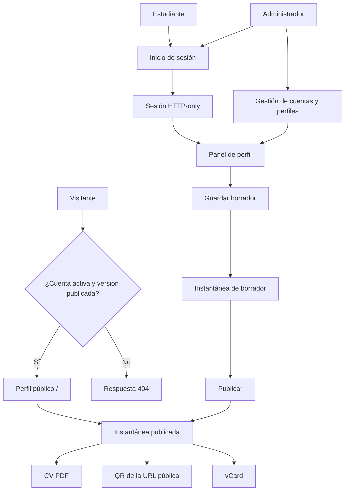
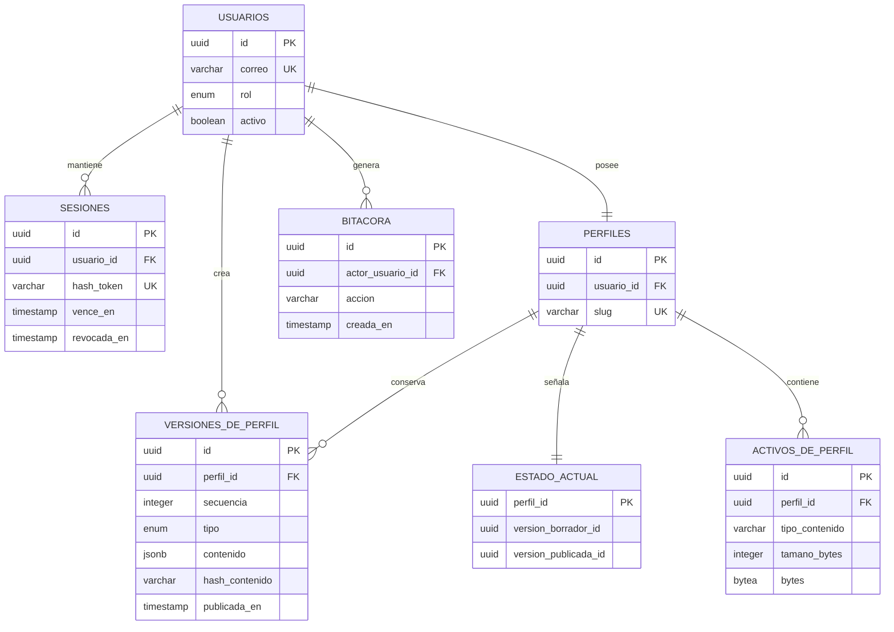

# EProfile

EProfile es una plataforma de tarjetas profesionales digitales para estudiantes. Combina un perfil público permanente, un área privada de edición y una administración global de cuentas.

La separación entre borrador y publicación es central: la página pública, el CV PDF, el QR y la vCard se construyen siempre desde la misma instantánea publicada. Un cambio guardado como borrador nunca se filtra al perfil público.

## Objetivo

La plataforma cubre tres roles:

- Visitante: consulta perfiles publicados y activos en `/<slug>`.
- Estudiante: administra exclusivamente su propio perfil desde `/<slug>/admin`.
- Administrador: gestiona estudiantes, contenidos y respaldos desde `/admin`.

Los slugs son únicos y permanentes. El valor `admin` está reservado. Para publicar se exigen, como mínimo, nombre y carrera.

## Flujo de la plataforma



## Modelo de datos



El diagrama representa las tablas `users`, `sessions`, `profiles`, `profile_versions`, `profile_current`, `profile_assets` y `audit_logs`. La tabla `profile_current` apunta de manera independiente al borrador y a la versión publicada. PostgreSQL valida que ambos punteros pertenezcan al mismo perfil y al tipo correcto; además, impide modificar snapshots existentes o cambiar un slug.

Cada versión guarda, en su JSON de contenido, nombre, carrera, reseña, contacto, formación, cursos, idiomas, habilidades, experiencia, proyectos, reconocimientos, enlaces, foto y plantilla de PDF. Los activos de perfil aceptan JPEG, PNG y WebP de hasta 2 MiB.

## Tecnologías

- Next.js 16, App Router, React 19, TypeScript y Tailwind CSS 4.
- PostgreSQL administrado en Neon mediante `@neondatabase/serverless`.
- Drizzle ORM y Drizzle Kit para el modelo y las migraciones.
- Zod para validar datos de formularios en servidor.
- `bcryptjs` con factor de trabajo 12 para las contraseñas.
- Sesiones persistidas, tokens aleatorios con HMAC-SHA-256 y cookies HTTP-only.
- `pdf-lib` para los CV en plantillas `classic` y `modern`.
- `qrcode` para QR PNG y `lucide-react` para iconografía.
- ESLint para revisión estática.

No se usa `localStorage` como reemplazo de la base de datos. Si falta `DATABASE_URL`, las operaciones de datos fallan de forma explícita.

## Rutas y recursos

- `/<slug>`: perfil público; requiere cuenta activa y una versión publicada.
- `/<slug>/admin`: edición del propietario; el administrador puede editar cualquier perfil.
- `/admin`: administración de cuentas, perfiles y respaldos.
- `/api/profile/<slug>/avatar`: fotografía de la versión publicada.
- `/api/profile/<slug>/pdf`: descarga el CV publicado; acepta `?template=classic` o `?template=modern`.
- `/api/profile/<slug>/qr`: QR PNG de la URL pública definitiva.
- `/api/profile/<slug>/vcard`: archivo `.vcf` con nombre, correo, teléfono y URL pública.
- `/api/admin/assets/<assetId>`: activo privado disponible sólo a una sesión autorizada.

Los recursos públicos responden con `404` si el perfil no está publicado o la cuenta está desactivada. Las acciones de servidor comprueban origen de petición, autenticación y rol.

## Seguridad y reglas de acceso

- Las contraseñas deben tener al menos 12 caracteres y se almacenan únicamente como hash.
- Las sesiones duran 14 días, se guardan en base de datos y pueden revocarse. La cookie usa `HttpOnly`, `SameSite=Lax` y `Secure` en producción.
- Un estudiante sólo recibe acceso a su perfil; el rol administrador puede gestionar todos.
- Desactivar a un estudiante revoca sus sesiones y retira su perfil de la vista pública.
- La publicación valida nombre y carrera. La consulta pública lee exclusivamente la instantánea marcada como publicada.
- Las fotografías se validan por tipo, tamaño y pertenencia al perfil.

## Requisitos previos

- Node.js `20.9.0` o superior.
- npm.
- Una base PostgreSQL de Neon y su cadena de conexión.

## Configuración de Neon

1. Cree un proyecto y una base PostgreSQL en Neon.
2. Copie la cadena de conexión y colóquela sólo en `.env.local` como `DATABASE_URL`.
3. Aplique las migraciones antes de iniciar el servidor o desplegar una versión que cambie el esquema.
4. Use bases independientes para desarrollo y producción.
5. Nunca confirme `.env.local`, la cadena de conexión ni contraseñas en Git.

La aplicación usa el controlador HTTP serverless de Neon. No existe una base local de respaldo ni se generan datos simulados si la conexión falta.

## Variables de entorno

Copie `.env.example` a `.env.local` y complete los valores:

```env
DATABASE_URL=
AUTH_SECRET=
NEXT_PUBLIC_APP_URL=http://localhost:3000
SEED_ADMIN_EMAIL=
SEED_ADMIN_PASSWORD=
SEED_STUDENT_PASSWORD=
```

- `DATABASE_URL`: cadena PostgreSQL de Neon.
- `AUTH_SECRET`: secreto de al menos 32 caracteres utilizado para el hash de sesión. Puede generarse con `node -e "console.log(require('node:crypto').randomBytes(32).toString('base64url'))"`.
- `NEXT_PUBLIC_APP_URL`: origen canónico sin barra final; el QR y la vCard se basan en este valor.
- `SEED_ADMIN_EMAIL` y `SEED_ADMIN_PASSWORD`: identidad elegida para el administrador inicial.
- `SEED_STUDENT_PASSWORD`: contraseña inicial del perfil de Daniel.

La semilla necesita `DATABASE_URL` y las tres variables `SEED_*`. `AUTH_SECRET` es indispensable para iniciar sesión, pero no para ejecutar la semilla. No hay credenciales de demostración ni contraseñas predeterminadas en el repositorio.

## Migraciones y semilla

Las migraciones de Drizzle se encuentran en `drizzle/`. Aplique las existentes con:

```bash
npx drizzle-kit migrate
```

Cree los registros iniciales con:

```bash
npx tsx scripts/seed.ts
```

La semilla es repetible y conservadora:

- Crea un administrador usando `SEED_ADMIN_EMAIL` y `SEED_ADMIN_PASSWORD` si todavía no existe.
- Crea el estudiante Daniel Del Angel Aranda en `/daniel-del-angel`, con correo `daniel.delangel03@iest.edu.mx` y la contraseña de `SEED_STUDENT_PASSWORD`.
- Crea snapshots separados de borrador y publicado para Daniel.
- Conserva usuarios, contenido, snapshots y contraseñas existentes.
- Se detiene ante conflictos de rol o de slug para no alterar datos ajenos.

Después de modificar el esquema, genere y revise una nueva migración antes de aplicarla:

```bash
npx drizzle-kit generate
npx drizzle-kit migrate
```

## Verlo en localhost

En PowerShell:

```powershell
Set-Location C:/Users/Daniel/Projects/eprofile-platform
npm ci
Copy-Item .env.example .env.local
```

Edite `.env.local` con la conexión Neon y secretos propios. Luego ejecute:

```powershell
npx drizzle-kit migrate
npx tsx scripts/seed.ts
npm run dev
```

Abra [http://localhost:3000](http://localhost:3000). Tras ejecutar la semilla, el perfil inicial estará en [http://localhost:3000/daniel-del-angel](http://localhost:3000/daniel-del-angel) y la administración en [http://localhost:3000/admin](http://localhost:3000/admin).

Si no desea cargar la semilla, complete las variables obligatorias, ejecute `npm run dev` y cree las cuentas mediante la administración disponible en la aplicación.

## Cuentas de prueba

No se incluyen secretos ni contraseñas en el código.

- Administrador: correo de `SEED_ADMIN_EMAIL` y contraseña de `SEED_ADMIN_PASSWORD`.
- Estudiante inicial: `daniel.delangel03@iest.edu.mx` y contraseña de `SEED_STUDENT_PASSWORD`.

Cambie las contraseñas iniciales antes de compartir una instancia o de usarla en producción.

## Lista de aceptación

Esta es una guía de validación manual por entorno; las casillas no indican que una prueba se haya ejecutado automáticamente.

- [ ] Una visita a `/<slug>` muestra contenido sólo para cuentas activas con versión publicada.
- [ ] Guardar un borrador no altera el perfil público, PDF, QR ni vCard hasta publicar.
- [ ] Publicar sin nombre o carrera es rechazado en el servidor.
- [ ] Un estudiante no puede leer ni modificar datos de otro estudiante.
- [ ] Un administrador puede crear, activar, desactivar, eliminar y restablecer cuentas.
- [ ] Desactivar una cuenta revoca sesiones y oculta el perfil público.
- [ ] El administrador puede editar y publicar contenido de cualquier estudiante.
- [ ] La exportación e importación de respaldos valida el formato antes de cambiar datos.
- [ ] Sólo se aceptan fotos JPEG, PNG o WebP de hasta 2 MiB.
- [ ] El QR apunta a `NEXT_PUBLIC_APP_URL/<slug>` y PDF, QR y vCard usan la versión publicada.
- [ ] El CV se descarga en las plantillas `classic` y `modern`.
- [ ] `npm run lint` y `npm run build` terminan sin errores antes de desplegar.

## Despliegue

1. Cree una base Neon exclusiva para producción y aplique `npx drizzle-kit migrate` con su `DATABASE_URL` de producción.
2. Configure `DATABASE_URL`, `AUTH_SECRET` y `NEXT_PUBLIC_APP_URL` en el proveedor de hospedaje. El último debe usar el dominio HTTPS definitivo.
3. Añada `SEED_*` sólo para una inicialización deliberada; no ejecute la semilla automáticamente en cada despliegue.
4. Instale con `npm ci`, compile con `npm run build` y ejecute con `npm run start`, o use el flujo equivalente del proveedor compatible con Next.js.
5. Verifique en producción el inicio de sesión, perfil público, PDF, QR, vCard y desactivación de una cuenta de prueba.

En producción la cookie de sesión usa el prefijo `__Host-` y el atributo `Secure`. Por eso, `NEXT_PUBLIC_APP_URL` debe coincidir con el origen HTTPS de la aplicación.

## Limitaciones y siguientes pasos

- Neon es obligatorio; no hay respaldo de datos local ni contenido ficticio cuando la conexión no existe.
- Las fotos se almacenan hoy en PostgreSQL y se limitan a 2 MiB. Un almacén de objetos con controles equivalentes sería adecuado para mayor volumen.
- Los respaldos son sensibles y deben restringirse a administradores, cifrarse al exportarse y conservarse con una política institucional.
- El restablecimiento de contraseña es administrativo. Un flujo de correo transaccional con enlaces de un solo uso sería una mejora futura.
- Antes de operar a escala conviene añadir pruebas de integración automatizadas para aislamiento, publicación, desactivación, PDF, QR, vCard y restauración de respaldos.

## Fuentes y bibliotecas

- [Next.js](https://nextjs.org/docs), App Router y despliegue.
- [Tailwind CSS](https://tailwindcss.com/docs), estilos de interfaz.
- [Neon](https://neon.com/docs), PostgreSQL serverless.
- [Drizzle ORM](https://orm.drizzle.team/docs/overview) y [Drizzle Kit](https://orm.drizzle.team/docs/kit-overview), modelo y migraciones.
- [Zod](https://zod.dev/), validación.
- [bcryptjs](https://github.com/dcodeIO/bcrypt.js), hash de contraseñas.
- [pdf-lib](https://pdf-lib.js.org/), generación del CV PDF.
- [node-qrcode](https://github.com/soldair/node-qrcode), códigos QR.
- [Lucide](https://lucide.dev/guide/packages/lucide-react), iconografía.
